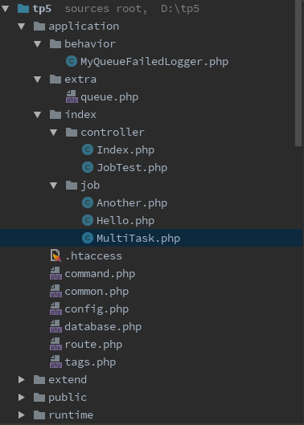
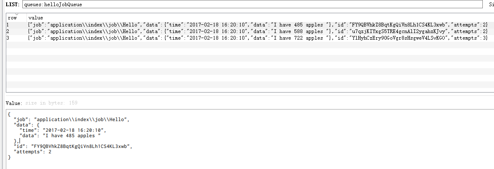
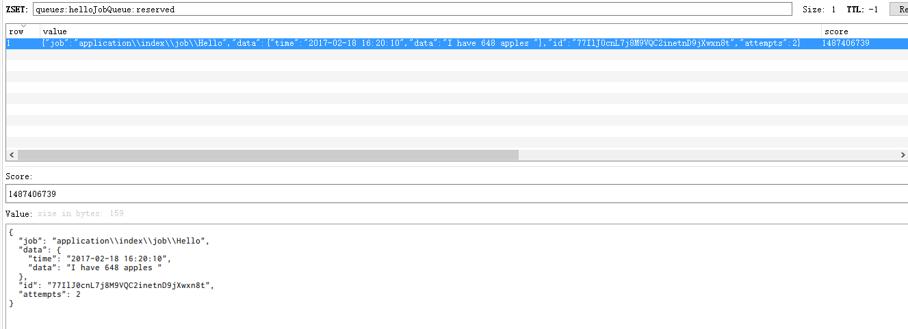
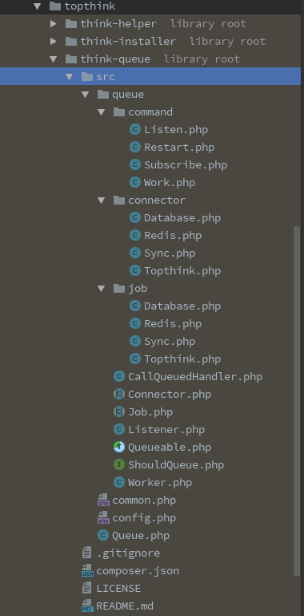

[TOC]

## thinkphp-queue 笔记 

### 前言 
**当前笔记中的内容针对的是 thinkphp-queue 的 v1.1.2 版本，现在官方已经更新到了 v1.1.3 版本， 笔记中的部分内容将会在最近某段空闲时间进行更新。**
传统的程序执行流程一般是 即时|同步|串行的，在某些场景下，会存在并发低，吞吐量低，响应时间长等问题。在大型系统中，一般会引入消息队列的组件，将流程中部分任务抽离出来放入消息队列，并由专门的消费者作针对性的处理，从而降低系统耦合度，提高系统性能和可用性。

一般来说，可以抽离的任务具有以下的特点：

- **允许延后|异步|并行处理** （相对于传统的 **即时|同步|串行** 的执行方式）
  - **允许延后**：

    抢购活动时，先快速缓冲有限的参与人数到消息队列，后续再排队处理实际的抢购业务；

  - **允许异步**：

    业务处理过程中的邮件，短信等通知

  - **允许并行**：

    用户支付成功之后，邮件通知，微信通知，短信通知可以由多个不同的消费者并行执行，通知到达的时间不要求先后顺序。

- **允许失败和重试**  

  - 强一致性的业务放入核心流程处理
  - 无一致性要求或最终一致即可的业务放入队列处理

**[thinkphp-queue](https://github.com/top-think/think-queue/releases)** 是thinkphp 官方提供的一个消息队列服务，它支持消息队列的一些基本特性：

- 消息的**发布**，**获取**，**执行**，**删除**，**重发**，**失败处理**，**延迟执行**，**超时控制**等
- 队列的**多队列**， **内存限制** ，**启动**，**停止**，**守护**等
- 消息队列可**降级为同步执行**

thinkphp-queue 内置了 **Redis**，**Database**，**Topthink** ，**Sync**这四种驱动。本文主要介绍 thinkphp-queue 结合其内置的 redis 驱动的使用方式和基本原理。

注1：如无特殊说明，下文中的 ‘消息’ 和 ‘任务’两个词指代的是同一个概念，即队列中的一个成员。该成员对消息队列而言是其内部保存的消息； 对业务应用而言是一个待执行的任务。请根据语境区分。

注2：本文编写时(2017-02-15)使用的 thinkphp-queue 的版本号是 v1.1.2 。该版本中部分功能并未全部完成，如 subscribe 模式，以及存在几个bug(稍后会提及)。如有变更，请以官方最新版为准。


###  一 代码示例

先通过一段代码，了解一下 thinkphp-queue 的基本使用流程。

> 目标： 
>
> 在业务控制器中推送一个新消息到一个名为 ‘helloJobQueue’ 的队列中，该消息中包含我们自定义的业务数据，然后，编写一个名为 Hello 的消费者类，并通过命令行去调用该消费者类获取这个消息，拿到定义的数据。

#### 1.1 安装 thinkphp-queue

```bash
composer install thinkphp-queue
```
#### 1.2 搭建消息队列的存储环境

- 使用 Redis [**推荐**]

  ```json
  安装并启动 Redis 服务
  ```

- 使用数据库 [不推荐]

  ```mysql
  CREATE TABLE `prefix_jobs` (
    `id` int(11) NOT NULL AUTO_INCREMENT,
    `queue` varchar(255) NOT NULL,
    `payload` longtext NOT NULL,
    `attempts` tinyint(3) unsigned NOT NULL,
    `reserved` tinyint(3) unsigned NOT NULL,
    `reserved_at` int(10) unsigned DEFAULT NULL,
    `available_at` int(10) unsigned NOT NULL,
    `created_at` int(10) unsigned NOT NULL,
    PRIMARY KEY (`id`)
  ) ENGINE=InnoDB DEFAULT CHARSET=utf8;
  ```

#### 1.3 配置消息队列的驱动

   根据选择的存储方式，在 `\application\extra\queue.php` 这个配置文件中，添加消息队列对应的驱动配置

```php
   return [
       'connector'  => 'Redis',		    // Redis 驱动
       'expire'     => 60,				// 任务的过期时间，默认为60秒; 若要禁用，则设置为 null 
       'default'    => 'default',		// 默认的队列名称
       'host'       => '127.0.0.1',	    // redis 主机ip
       'port'       => 6379,			// redis 端口
       'password'   => '',				// redis 密码
       'select'     => 0,				// 使用哪一个 db，默认为 db0
       'timeout'    => 0,				// redis连接的超时时间
       'persistent' => false,			// 是否是长连接
     
   //    'connector' => 'Database',   // 数据库驱动
   //    'expire'    => 60,           // 任务的过期时间，默认为60秒; 若要禁用，则设置为 null
   //    'default'   => 'default',    // 默认的队列名称
   //    'table'     => 'jobs',       // 存储消息的表名，不带前缀
   //    'dsn'       => [],

   //    'connector'   => 'Topthink',	// ThinkPHP内部的队列通知服务平台 ，本文不作介绍
   //    'token'       => '',
   //    'project_id'  => '',
   //    'protocol'    => 'https',
   //    'host'        => 'qns.topthink.com',
   //    'port'        => 443,
   //    'api_version' => 1,
   //    'max_retries' => 3,
   //    'default'     => 'default',

   //    'connector'   => 'Sync',		// Sync 驱动，该驱动的实际作用是取消消息队列，还原为同步执行
   ];
```

   **1.3.1 配置文件中的 expire 参数说明**

   expire 参数指的是任务的过期时间。 过期的任务，其准确的定义是

1. 任务的状态为执行中
2. 任务的开始执行的时刻 + expire > 当前时刻 

expire 不为`null` 时 ，thinkphp-queue 会在每次获取下一个任务之前检查并重发过期(执行超时)的任务。

expire 为`null` 时，thinkphp-queue 不会检查过期的任务，性能相对较高一点。但是需要注意：

- 这些执行超时的任务会一直留在消息队列中，需要开发者另行处理(删除或者重发)！
- [ **[Bug](https://github.com/top-think/think-queue/issues/12)** ]在redis 驱动下，expire 设置为 null 时，无法实现任务的延迟执行!  (Database 驱动下无影响)

**对expire 参数理解或者使用不当时，很容易产生一些bug**，后面会举例提到。

#### 1.4 消息的创建与推送 

我们在业务控制器中创建一个新的消息，并推送到 `helloJobQueue` 队列

新增 `\application\index\controller\JobTest.php` 控制器，在该控制器中添加 `actionWithHelloJob` 方法

```php
<?php
/**
* 文件路径： \application\index\controller\JobTest.php
* 该控制器的业务代码中借助了thinkphp-queue 库，将一个消息推送到消息队列
*/
namespace application\index\controller;
  use think\Exception;

  use think\Queue;

  class JobTest {
  /**
   * 一个使用了队列的 action
   */
  public function actionWithHelloJob(){
      
      // 1.当前任务将由哪个类来负责处理。 
      //   当轮到该任务时，系统将生成一个该类的实例，并调用其 fire 方法
      $jobHandlerClassName  = 'application\index\job\Hello'; 
      // 2.当前任务归属的队列名称，如果为新队列，会自动创建
      $jobQueueName  	  = "helloJobQueue"; 
      // 3.当前任务所需的业务数据 . 不能为 resource 类型，其他类型最终将转化为json形式的字符串
      //   ( jobData 为对象时，需要在先在此处手动序列化，否则只存储其public属性的键值对)
      $jobData       	  = [ 'ts' => time(), 'bizId' => uniqid() , 'a' => 1 ] ;
      // 4.将该任务推送到消息队列，等待对应的消费者去执行
      $isPushed = Queue::push( $jobHandlerClassName , $jobData , $jobQueueName );	
      // database 驱动时，返回值为 1|false  ;   redis 驱动时，返回值为 随机字符串|false
      if( $isPushed !== false ){  
          echo date('Y-m-d H:i:s') . " a new Hello Job is Pushed to the MQ"."<br>";
      }else{
          echo 'Oops, something went wrong.';
      }
  }
 }
```

**注意:** 在这个例子当中，我们是手动指定的 `$jobHandlerClassName` ，更合理的做法是先定义好消息名称与消费者类名的映射关系，然后由某个可以获取该映射关系的类来推送这个消息。这样，生产者只需要知道消息的名称，而无需指定哪个消费者类来处理。

> 除了 `Queue::push( $jobHandlerClassName , $jobData , $jobQueueName );	`这种方式之外，还可以直接传入 `Queue::push( $jobHandlerObject ,null , $jobQueueName );` 这时，需要在 $jobHandlerObject 中定义一个 `handle()` 方法，消息队列在执行到该任务时会自动反序列化该对象，并调用其 `handle()`方法。 该方式的缺点是无法传入自定义数据。

#### 1.5 消息的消费与删除

编写 Hello 消费者类，用于处理 `helloJobQueue` 队列中的任务

新增 `\application\index\job\Hello.php` 消费者类，并编写其 `fire()`  方法

```php
 <?php
  /**
   * 文件路径： \application\index\job\Hello.php
   * 这是一个消费者类，用于处理 helloJobQueue 队列中的任务
   */
  namespace application\index\job;

  use think\queue\Job;

  class Hello {
      
      /**
       * fire方法是消息队列默认调用的方法
       * @param Job            $job      当前的任务对象
       * @param array|mixed    $data     发布任务时自定义的数据
       */
      public function fire(Job $job,$data){
          
          $isJobDone = $this->doHelloJob($data);
        
          if ($isJobDone) {
              //如果任务执行成功， 记得删除任务
              $job->delete();
              print("<info>Hello Job has been done and deleted"."</info>\n");
          }else{
              if ($job->attempts() > 3) {
                  //通过这个方法可以检查这个任务已经重试了几次了
                  print("<warn>Hello Job has been retried more than 3 times!"."</warn>\n");
  				$job->delete();
                  // 也可以重新发布这个任务
                  //print("<info>Hello Job will be availabe again after 2s."."</info>\n");
                  //$job->release(2); //$delay为延迟时间，表示该任务延迟2秒后再执行
              }
          }
      }

      /**
       * 根据消息中的数据进行实际的业务处理
       * @param array|mixed    $data     发布任务时自定义的数据
       * @return boolean                 任务执行的结果
       */
      private function doHelloJob($data) {
  		// 根据消息中的数据进行实际的业务处理...
        
          print("<info>Hello Job Started. job Data is: ".var_export($data,true)."</info> \n");
          print("<info>Hello Job is Fired at " . date('Y-m-d H:i:s') ."</info> \n");
          print("<info>Hello Job is Done!"."</info> \n");
          
          return true;
      }
  }
```

至此，所有的代码都已准备完毕，在运行消息队列之前，我们先看一下现在的目录结构：



#### 1.6 发布任务

在浏览器中访问  http://your.project.domain/index/job_test/actionWithHelloJob ,可以看到消息推送成功。


#### 1.7 处理任务

切换当前终端窗口的目录到项目根目录下，执行

```bash
php think queue:work --queue helloJobQueue
```
可以看到执行的结果类似如下:


​


至此，我们成功地经历了一个消息的 创建 -> 推送 -> 消费 -> 删除  的基本流程

下文，将介绍 thinkphp-queue 的详细使用方法。如配置介绍，基本原理，各种特殊情况的处理等

### 二 详细介绍

#### 2.1 命令模式

- **queue:subscribe 命令** [截至2017-02-15，作者暂未实现该模式，略过]

- **queue:work 命令**

  work 命令： 该命令将启动一个 work 进程来处理消息队列。

  ```bash
  php think queue:work --queue helloJobQueue
  ```

- **queue:listen 命令**

  listen 命令： 该命令将会创建一个 listen 父进程 ，然后由父进程通过 `proc_open(‘php think queue:work’)` 的方式来创建一个work 子 进程来处理消息队列，且限制该work进程的执行时间。 

  ```bash
  php think queue:listen --queue helloJobQueue
  ```

#### 2.2 命令行参数

- Work 模式

  ```bash
  php think queue:work \
  --daemon            //是否循环执行，如果不加该参数，则该命令处理完下一个消息就退出
  --queue  helloJobQueue  //要处理的队列的名称
  --delay  0 \        //如果本次任务执行抛出异常且任务未被删除时，设置其下次执行前延迟多少秒,默认为0
  --force  \          //系统处于维护状态时是否仍然处理任务，并未找到相关说明
  --memory 128 \      //该进程允许使用的内存上限，以 M 为单位
  --sleep  3 \        //如果队列中无任务，则sleep多少秒后重新检查(work+daemon模式)或者退出(listen或非daemon模式)
  --tries  2          //如果任务已经超过尝试次数上限，则触发‘任务尝试次数超限’事件，默认为0
  ```

- Listen 模式

  ```bash
  php think queue:listen \
  --queue  helloJobQueue \   //监听的队列的名称
  --delay  0 \         //如果本次任务执行抛出异常且任务未被删除时，设置其下次执行前延迟多少秒,默认为0
  --memory 128 \       //该进程允许使用的内存上限，以 M 为单位
  --sleep  3 \         //如果队列中无任务，则多长时间后重新检查，daemon模式下有效
  --tries  0 \         //如果任务已经超过重发次数上限，则进入失败处理逻辑，默认为0
  --timeout 60         //创建的work子进程的允许执行的最长时间，以秒为单位
  ```

  可以看到 listen 模式下，不包含 `--deamon` 参数，原因下面会说明

#### 2.3 work 模式和 listen 模式的区别

两者都可以用于处理消息队列中的任务

区别在于:

- **2.3.1 执行原理不同**

  - work 命令是**单进程**的处理模式。

    按照是否设置了 `--daemon` 参数，work命令又可分为单次执行和循环执行两种模式。

    - 单次执行：不添加 `--daemon`参数，该模式下,work进程在处理完下一个消息后直接结束当前进程。当不存在新消息时，会sleep一段时间然后退出。
    - 循环执行：添加了 `--daemon`参数，该模式下,work进程会循环地处理队列中的消息，直到内存超出参数配置才结束进程。当不存在新消息时，会在每次循环中sleep一段时间。

  - listen 命令是 **父进程 + 子进程** 的处理模式。

    listen命令所在的父进程会创建一个**单次执行模式的work子进程**，并通过该work子进程来处理队列中的下一个消息，当这个work子进程退出之后，listen命令所在的父进程会监听到该子进程的退出信号，并重新创建一个新的**单次执行的work子进程**

- **2.3.2 退出时机不同**

  - work 命令的退出时机在上面的执行原理部分已叙述，此处不再重复
  - listen 命令中，listen所在的父进程正常情况会一直运行，除非遇到下面两种情况：
    - 创建的某个work子进程的执行时间超过了 listen命令行中的`--timeout` 参数配置，此时work子进程会被强制结束，listen所在的父进程也会抛出一个 `ProcessTimeoutException` 异常并退出。开发者可以选择捕获该异常，让父进程继续执行，也可以选择通过 supervisor 等监控软件重启一个新的listen命令。
    - listen 命令所在的父进程因某种原因存在内存泄露，则当父进程本身占用的内存超过了命令行中的 `--memory` 参数配置时，父子进程均会退出。正常情况下，listen进程本身占用的内存是稳定不变的。

- **2.3.3 性能不同**

  - work 命令是在脚本内部做循环，框架脚本在命令执行的初期就已加载完毕；

  - 而listen模式则是处理完一个任务之后新开一个work进程，此时会重新加载框架脚本。

    因此： **work 模式的性能会比listen模式高**。

    注意：当代码有更新时，work 模式下需要手动去执行 `php think queue:restart` 命令重启队列来使改动生效；而listen 模式会自动生效,无需其他操作。

- **2.3.4 超时控制能力**

  - work 模式本质上既不能控制进程自身的运行时间，也无法限制执行中的任务的执行时间。

    举例来说，假如你在某次上线之后，在上文中的  `\application\index\job\Hello.php` 消费者的`fire`方法中添加了一段死循环 ：

    ```php
    public function fire(){
       while(true){ //死循环
           $consoleOutPut->writeln("<info>I am looping forever inside a job.</info> \n");
           sleep(1);
       }
    }  
    ```

    那么这个循环将永远不能停止，直到任务所在的进程超过内存限制或者由管理员手动结束。这个过程不会有任何的告警。更严重的是，如果你配置了expire ，那么这个死循环的任务可能会污染到同样处理 `helloJobQueue` 队列的其他work进程，最后好几个work进程将被卡死在这段死循环中。详情后文会说明。

    **work 模式下的超时控制能力，实际上应该理解为 多个work 进程配合下的过期任务重发能力。**

  - 而 listen命令可以限制其创建的work子进程的超时时间。

    listen 命令可通过 `--timeout` 参数限制work子进程允许运行的最长时间，超过该时间限制仍未结束的子进程会被强制结束；

  - 这里有必要补充一下 expire 和 timeout 之间的区别：

    - expire 在配置文件中设置，timeout 在 listen命令 的命令行参数中设置，而且，expire 和 timeout 是两个不同层次上的概念：


    - expire 是指任务的过期时间。这个时间是全局的，影响到所有的work进程。(不管是独立的work命令还是 listen 模式下创建的的work子进程) 。expire 针对的对象是 **任务**。
    - timeout 是指work子进程的超时时间。这个时间只对当前执行的listen 命令有效。timeout 针对的对象是 **work子进程**。

- **2.3.5 使用场景不同**

  根据上面的介绍，可以看到，

  work 命令的适用场景是：

  - 任务数量较多
  - 性能要求较高
  - 任务的执行时间较短
  - 消费者类中不存在死循环，sleep() ，exit() ,die() 等容易导致bug的逻辑

  listen命令的适用场景是：

  - 任务数量较少
  - 任务的执行时间较长(如生成大型的excel报表等)，
  - 任务的执行时间需要有严格限制


#### 2.4 消息队列的开始，停止与重启

- 开始一个消息队列：

  ```bash
  php think queue:work
  ```


- 停止所有的消息队列：

  ```bash
  php think queue:restart
  ```

- 重启所有的消息队列： 

  ```bash
  php think queue:restart 
  php think queue:work 
  ```

#### 2.5 多模块，多任务的处理

- 多模块

  > 单模块项目推荐使用 `app\job` 作为任务类的命名空间 
  >
  > 多模块项目可用使用 `app\module\job` 作为任务类的命名空间 也可以放在任意可以自动加载到的地方

- 多任务

  > 如果一个任务类里有多个小任务的话，在发布任务时，需要用 `任务的类名@方法名` 如 `app\lib\job\Job2@task1`、`app\lib\job\Job2@task2`
  >
  > 注意：命令行中的 --queue  参数不支持@解析

  多任务例子:

  - 在 `\application\index\controller\JobTest.php` 控制器中，添加 `actionWithMultiTask()`方法：

  ```php
  public function actionWithMultiTask(){
      	
    $taskType = $_GET['taskType'];
      switch ($whichTask) {
         case 'taskA':
             $jobHandlerClassName  = 'application\index\job\MultiTask@taskA';
             $jobDataArr = ['a'	=> '1'];
             $jobQueueName = "multiTaskJobQueue";	
             break;
         case 'taskB':
             $jobHandlerClassName  = 'application\index\job\MultiTask@taskB';
             $jobDataArr = ['b'	=> '2'];
             $jobQueueName = "multiTaskJobQueue";		
             break;
          default:
             break;
     }
    
    $isPushed = Queue::push($jobHandlerClassName, $jobDataArr, $jobQueueName);
    if ($isPushed !== false) {
      echo("the $taskType of MultiTask Job has been Pushed to ".$jobQueueName ."<br>");
    }else{
      throw new Exception("push a new $taskType of MultiTask Job Failed!");
    }
  }
  ```

  - 新增 `\application\index\job\MultiTask.php` 消费者类，并编写其 `taskA()`  和 `taskB()`方法

  ```php
  <?php
  /**
   * 文件路径： \application\index\job\MultiTask.php
   * 这是一个消费者类，用于处理 multiTaskJobQueue 队列中的任务
   */
  namespace application\index\job;

  use think\queue\Job;

  class MultiTask {
   
      public function taskA(Job $job,$data){
          
          $isJobDone = $this->_doTaskA($data);

          if ($isJobDone) {
              $job->delete();
              print("Info: TaskA of Job MultiTask has been done and deleted"."\n");
          }else{
              if ($job->attempts() > 3) {
                  $job->delete(); 	
              }
          }
      }
    
      public function taskB(Job $job,$data){
          
          $isJobDone = $this->_doTaskA($data);

          if ($isJobDone) {
              $job->delete();
              print("Info: TaskB of Job MultiTask has been done and deleted"."\n");
          }else{
              if ($job->attempts() > 2) {
                  $job->release(); 	
              }
          }
      }

      private function _doTaskA($data) {
          print("Info: doing TaskA of Job MultiTask "."\n");
          return true;
      }
    
      private function _doTaskB($data) {
          print("Info: doing TaskB of Job MultiTask "."\n");
          return true;
      }
  ```

#### 2.6 消息的延迟执行与定时执行

延迟执行，相对于即时执行，是用来限制某个任务的最早可执行时刻。在到达该时刻之前，该任务会被跳过。

可以利用该功能实现**定时任务**。

使用方式：

- 在生产者业务代码中：

```php
// 即时执行
$isPushed = Queue::push($jobHandlerClassName, $jobDataArr, $jobQueueName);
// 延迟 2 秒执行
$isPushed = Queue::later( 2, $jobHandlerClassName, $jobDataArr, $jobQueueName);
// 延迟到 2017-02-18 01:01:01 时刻执行
$time2wait = strtotime('2017-02-18 01:01:01') - strtotime('now');	
$isPushed = Queue::later($time2wait,$jobHandlerClassName, $jobDataArr, $jobQueueName);
```

- 在消费者类中：

```php
// 重发，即时执行
$job->release();
// 重发，延迟 2 秒执行
$job->release(2);
// 延迟到 2017-02-18 01:01:01 时刻执行
$time2wait = strtotime('2017-02-18 01:01:01') - strtotime('now');
$job->release($time2wait);
```

- 在命令行中：

```bash
//如果消费者类的fire()方法抛出了异常且任务未被删除时，将自动重发该任务，重发时，会设置其下次执行前延迟多少秒,默认为0
php think queue:work --delay 3  
```

#### 2.7 消息的重发

thinkphp-queue 中，消息的重发时机有3种：

- 2.7.1 在消费者类中手动重发：

```php
if( $isJobDone === false){
    $job->release();
}
```

- 2.7.2 work进程自动重发，需同时满足以下两个条件
  - 消费者类的 fire() 方法抛出了异常
  - 任务未被删除
- 2.7.3 当配置了 expire 不为 `null` 时，work 进程内部每次查询可用任务之前，会先自动重发已过期的任务。

> 补充：
>
> 在database 模式下，2.7.1 和 2.7.2 中的重发逻辑是先删除原来的任务，然后插入一个新的任务。2.7.3 中的重发时机是直接更新原任务。
>
> 而在redis 模式下，3种重发都是先删除再插入。
>
> 不管是哪种重发方式，重发之后，任务的已尝试次数会在原来的基础上 +1 。

此外，消费者类中需要注意，如果 `fire()` 方法中可能抛出异常，那么

- 如果不需要自动重发的话， 请在抛出异常之前将任务删除 `$job->delete()` ，以免产生bug。
- 如果需要自动重发的话，请直接抛出异常，不要在 `fire()` 方法中又手动使用 `$job->release()` , 这样会导致该任务被重发两次，产生两个一样的新任务。

#### 2.8 任务的失败回调及告警

当同时满足以下条件时，将触发任务失败回调：

- 命令行的 `--tries` 参数的值大于0
- 任务的已尝试次数大于 命令行的 `--tries` 参数
- 开发者添加了 `queue_failed` 事件标签及其对应的回调代码
- 消费者类中定义了 `failed()` 方法，用于接收任务失败的通知

注意， `queue_failed` 标签需要在安装了 `thinkphp-queue ` 之后 **手动** 去 `\application\tags.php` 文件中添加。

**注意：该版本有[bug](https://github.com/top-think/think-queue/issues/10)，若想实现失败任务回调功能，需要先修改位于 `think-queue\src\queue\Worker.php` 中的 `logFailedJob`方法 , 修改方式如下:**

```php
/**
 * Log a failed job into storage.
 * @param  \Think\Queue\Job $job
 * @return array
 */
    protected function logFailedJob(Job $job)
    {
        // 将原来的 queue.failed' 修改为 'queue_failed' 才可以触发任务失败回调
        if (Hook::listen('queue.failed', $job, null, true)) {  
            $job->delete();
            $job->failed();
        }

        return ['job' => $job, 'failed' => true];
    } 
```

首先，我们添加 `queue_failed` 事件标签,  及其对应的回调方法

```php
// 文件路径： \application\tags.php
// 应用行为扩展定义文件
return [
    // 应用初始化
    'app_init'     => [],
    // 应用开始
    'app_begin'    => [],
    // 模块初始化
    'module_init'  => [],
    // 操作开始执行
    'action_begin' => [],
    // 视图内容过滤
    'view_filter'  => [],
    // 日志写入
    'log_write'    => [],
    // 应用结束
    'app_end'      => [],

    // 任务失败统一回调,有四种定义方式
    'queue_failed'=> [
      
         // 数组形式，[ 'ClassName' , 'methodName']
        ['application\\behavior\\MyQueueFailedLogger', 'logAllFailedQueues']
         
         // 字符串(静态方法)，'StaicClassName::methodName'
         // 'MyQueueFailedLogger::logAllFailedQueues'   
      
         // 字符串(对象方法)，'ClassName'，此时需在对应的ClassName类中添加一个名为 queueFailed 的方法
         // 'application\\behavior\\MyQueueFailedLogger'
         
         // 闭包形式
         /*
         function( &$jobObject , $extra){
             // var_dump($jobObject);
             return true;
         }
         */
    ]
];
```

这里，我们选择数组形式的回调方式，新增 `\application\behavior\MyQueueFailedLogger` 类，添加一个 `logAllFailedQueues()` 方法

```php
<?php
/**
 * 文件路径: \application\behavior\MyQueueFailedLogger.php
 * 这是一个行为类，用于处理所有的消息队列中的任务失败回调
 */

namespace application\behavior;


class MyQueueFailedLogger {
       
    const should_run_hook_callback = true;
  
    /**
     * @param $jobObject   \think\queue\Job   //任务对象，保存了该任务的执行情况和业务数据
     * @return bool     true                  //是否需要删除任务并触发其failed() 方法
     */
    public function logAllFailedQueues(&$jobObject){
        
        $failedJobLog = [
            'jobHandlerClassName'   => $jobObject->getName(), // 'application\index\job\Hello'
            'queueName' => $jobObject->getQueue(),			   // 'helloJobQueue'	 
            'jobData'   => $jobObject->getRawBody()['data'],  // '{'a': 1 }'
            'attempts'  => $jobObject->attempts(),            // 3
        ];
        var_export(json_encode($failedJobLog,true));
        
           // $jobObject->release();     //重发任务
          //$jobObject->delete();         //删除任务
          //$jobObject->failed();	  //通知消费者类任务执行失败
        
        return self::should_run_hook_callback;         
    }
}
```

需要注意该回调方法的返回值：

- 返回 true  时，系统会自动删除该任务，并且自动调用消费者类中的 `failed()` 方法
- 返回 false 时，系统不会自动删除该任务，也不会自动调用消费者类中的 `failed()` 方法，需要开发者另行处理失败任务的删除和通知。

最后，在消费者类中，添加 `failed()` 方法

```php
/**
 * 文件路径： \application\index\job\HelloJob.php
 */

/**
 * 该方法用于接收任务执行失败的通知，你可以发送邮件给相应的负责人员
 * @param $jobData  string|array|...      //发布任务时传递的 jobData 数据
 */
public function failed($jobData){
    send_mail_to_somebody() ; 
    
    print("Warning: Job failed after max retries. job data is :".var_export($data,true)."\n"; 
}
```

这样，就可以做到任务失败的**记录**与**告警**

#### 2.9 处理过期的任务

过期这个概念用文字比较难描述清楚，建议先看一下 **深入理解** 中 **3.4 消息处理的详细流程图**

### 三 深入理解
#### 3.1 thinkphp-queue 中消息与队列的保存方式

- Redis

  在 Redis 中，每一个 队列 都三个key 与之对应 ，以 helloJobQueue 队列举例，其在redis 中的保存方式为：

  | key名                          | 类型              | 说明             |
  | ----------------------------- | --------------- | -------------- |
  | queues:helloJobQueue          | List ， 列表       | 待执行的任务列表       |
  | queues:helloJobQueue:delayed  | Sorted Set，有序集合 | 延迟执行和定时执行的任务集合 |
  | queues:helloJobQueue:reserved | Sorted Set，有序集合 | 执行中的任务集合       |

  > 使用的`:`分隔符, 只是用来表示相关key的关联性。本身没有特殊含义。使用分隔符是一种常见的组织key的方式。

  其中，在`queues:helloJobQueue` 列表中，每个元素的形式如下：

  

  在 `queues:helloJobQueue:delayed` 和 `queues:helloJobQueue:delayed` 有序集合中，每个元素的形式如下：

  

  可以看到，在有序集合中，每个元素代表一个任务，该元素的 Score 为该任务的入队时间戳，任务的 value 为json 格式，保存了任务的执行情况和业务数据。将value decode 为数组后形式如下：

  ```php
  [
    'job'  => 'application\\index\\job\\Hello' ,  // jobHandlerClassName，消费者类的类名 
    'data' => [					  // 生产者传入的业务数据
       'time' => '2017-02-18 16:20:10',
       'data' => 'I have 648 apples'
    ],
    'id'   => '77IasdasadIasdadadadKL8t',	// 一个随机的32位字符串
    'attempts' => 2				// 任务的已尝试次数
  ]
  ```
  redis驱动下，为了实现任务的延迟执行和过期重发，任务将在这三个key中来回转移，详情可见 3.5

- Database

  在 Database 中，每个任务对应到表中的一行，queue 字段用来区分不同的队列。

  表的字段结构如下:

  

  其中，payLoad 字段保存了消息的执行者和业务数据，payLoad 字段采用 json 格式的字符串来保存消息，将其 decode 为数组后形式如下：

  ```php
  [
   'job'   => 'application\\index\\job\\Hello', // jobHandlerClassName，消费者类的类名 
   'data'  => string|array|integer|object       // 生产者传入的业务数据
  ]
  ```

#### 3.2 thinkphp-queue 的目录结构和类关系图



这些类构成了消息队列中的几个角色：

| 角色   | 类名                | 说明                    |
| ---- | ----------------- | --------------------- |
| 命令行  | Command + Worker  | 负责解析命令行参数，控制队列的启动，重启  |
| 驱动   | Queue + Connector | 负责队列的创建，以及消息的入队，出队等操作 |
| 任务   | Job               | 用于将消息转化为一个任务对象，供消费者使用 |
| 生产者  | 业务代码              | 负责消息的创建与发布            |
| 消费者  | 业务代码              | 负责任务的接收与执行            |

各个类之间的关系图如下：


#### 3.3 Deamon模式的执行流程


#### 3.4 Database模式下消息处理的详细流程 

下图中，展示了database 模式下消息处理的详细流程，redis 驱动下大体类似


#### 3.5 redis 驱动下的任务重发细节

在redis驱动下，为了实现任务的延迟执行和过期重发，任务将在这三个key中来回转移。

在3.4 Database模式下消息处理的消息流程中，我们知道，如果配置的expire 不是null ，那么 thinkphp-queue的work进程每次在获取下一个可执行任务之前，会先尝试重发所有过期的任务。而在redis驱动下，这个步骤则做了更多的事情，详情如下：

1. 从 `queue:xxx:delayed` 的key中查询出有哪些任务在当前时刻已经可以开始执行，然后将这些任务转移到 `queue:xxx` 的key的尾部。
2. 从 `queue:xxx:reserved` 的key中查询出有哪些任务在当前时刻已经过期，然后将这些任务转移到 `queue:xxx`的key的尾部。
3. 尝试从 `queue:xxx` 的key的头部取出一个任务，如果取出成功，那么，将这个任务转移到 `queue:xxx:reserved` 的key 的头部，同时将这个任务实例化成任务对象，交给消费者去执行。

用图来表示这个步骤的具体过程如下：

redis队列中的过期任务重发步骤--执行前：


redis队列中的过期任务重发步骤--执行后：


#### 3.6 thinkphp-queue的性能

- 测试环境 :

  虚拟机 Ubuntu 16.04 ， PHP 7.1 ，TP5，Redis 3.2 ， 双核 I5 6400，3G 内存

- 测试方式 :

  使用 Redis 驱动，在一个控制器中循环推送 40000 条消息到消息队列； 

  使用`php think queue:work --daemon`去消费这些消息，计算推送和消费各自所耗的时间。


- 测试结果 :

  在最简单的逻辑下，平均每秒中可推送8000个消息，平均每秒可消费200个消息。

**注意：**由于在测试时，Host 机本身的cpu和内存长期100%，并且虚拟机中的各项服务并未专门调优，因此该测试结果**并不具备参考性**。

#### 3.7 thinkphp-queue 的N种错误使用姿势

-   **3.7.1** 在 消费者类的 `fire()` 方法中，忘记使用 `$job->delete()` 去删除消息，这种情况下，会产生一系列的bug：

    - 配置的 expire 为 `null` ， 则该任务被执行一次后会永远留在消息队列中，占用消息队列的空间 , 除非开发者另行处理。

    - 配置的 expire `不为 null` ，该任务在 expire 秒后被认为是过期任务，并被消息队列还原为待执行状态，在消息队列的后面的循环中继续被获取，这时，如果

      - 命令行中的 `--tries` 参数为0 或者未设置,那么每隔 一段时间该任务就会被执行一次。
      - 命令行中的 `--tries` 参数 n 大于0 ， 那么当这个任务被误执行的次数超过n 时，会由消息队列尝试去触发失败回调事件:
        - 如果开发者没有编写失败处理的回调事件：那么该任务仍然不会被删除，每隔一段时间就会被执行一次。[这个可能属于框架的[Bug](https://github.com/top-think/think-queue/issues/10)] , 
        - 如果编写了失败回调事件
          - 回调事件中删除了任务，则这个任务被误执行了 n 次。
          - 回调事件中未删除任务，这时，如果：
            - 回调事件返回值是 false，那么该任务仍然不会被删除，每隔一段时间就会被执行一次
            - 回调事件返回值是 true， 那么该任务会先被删除，然后触发消费者类的 failed() 方法，如果在 failed() 方法中设置了告警，那么这个告警就是一次误报。

    因此，在 使用 thinkphp-queue 时，请记得：

    - **任务完成后, 使用 `$job->delete()` 删除任务**
    - 在消费者类的 `fire()` 方法中，使用 `$job->attempt()`  检查任务已执行次数，对于次数异常的，作相应的处理。
    - 在消费者类的 `fire()` 方法中，根据业务数据来判断该任务是否已经执行过，以避免该任务被重复执行。
    - 编写失败回调事件，将事件中失败的任务及时通知给开发人员。


-   **3.7.2** 使用了 `queue:work --daemon` ，但更新代码后没有使用 `queue:restart` 重启 work 进程, 使得 work  进程中的代码与最新的代码不同，出现各种问题。

-   **3.7.3** 使用了 `queue:work --daemon` ，但是消费者类的 fire() 方法中存在死循环，或 `sleep(n)` 等逻辑，导致消息队列被堵塞；或者使用了 `exit()` , `die()` 这样的逻辑，导致work进程直接终止 。

-   **3.7.4** 配置的 expire 为 `null` ，这时如果采用的是 Redis 驱动且使用了延迟功能，如 `later(n)`  ， `release(n)` 方法或者 `--delay` 参数不为0 ， 那么将导致被延迟的任务永远无法处理。(这个可能属于框架的[Bug](https://github.com/top-think/think-queue/issues/12))

-   **3.7.5** 配置的 expire 为`null` ，但并没有自行处理过期的任务，导致过期的任务得不到处理，且一直占用消息队列的空间。

-   **3.7.6** 配置的 expire `不为null` ，但配置的 expire 时间太短，以至于  expire 时间 < 消费者的 `fire()` 方法所需时间 +  删除该任务所需的时间 ，那么任务将被误认为执行超时，从而被消息队列还原为待执行状态。

-   **3.7.7** 使用 `Queue::push($jobHandlerClassName , $jobData, $jobQueueName );` 推送任务时，`$jobData` 中包含未序列化的对象。这时，在消费者端拿到的 `$jobData ` 中拿到的是该对象的public 属性的键值对数组。因此，需要在推送前手动序列化对象，在消费者端再手动反序列化还原为对象。


### 四 拓展

#### 4.1 队列的稳定性和拓展性

- 稳定性：不管是 listen 模式还是 work 模式，都建议使用 supervisor 或者 自定义的cron 脚本，去定时检查 work 进程是否正常
- 拓展性： 当某个队列的消费者不足时，再给这个队列添加 work进程即可。

#### 4.2 消息队列的可视化管理工具 

- 队列管理，队列的列表，队列的 work 进程数量控制，队列的任务数量变化趋势  //TBD
- 任务管理，任务的列表，添加/**撤回**/查询任务，修改任务的 执行者/执行时间/优先级/数据 等  //TBD

#### 4.2 编写自定义的 thinkphp-queue 驱动

//TBD

#### 4.3 编写消息队列的单元测试

//TBD

#### 4.4 与其他PHP消息队列库的对比

TP5的消息队列与Laravel的消息队列比较相似，下面是与laravel 中的消息队列的一些对比：

|           | thinkphp-queue (v1.1.2)             | laravel-queue (v5.3)                    |
| --------- | ----------------------------------- | --------------------------------------- |
| 内置的驱动     | Database，Redis，Sync，TopThink        | Database，Redis, Sync(在laravel中称为 null)。 |
| Redis驱动要求 | 安装redis的C扩展                         | 安装 predis 包 + LUA脚本                     |
| 推送任务      | 允许推送 消费者类名，消费者对象                    | 允许推送消费者类名，消费者对象，闭包                      |
| 失败任务处理    | 触发失败回调事件 (有Bug)                     | 触发失败回调事件 + 移动任务到 failed_jobs表?          |
| 消息订阅      | subscribe 命令+ Topthink驱动(注：未实现/未提供) | subscribe 命令 + 安装IronMQ 驱动              |
| 删除任务      | 消费者类中手动删除                           | 任务完成后自动删除                               |
| 推送到多个队列   | 需自己实现                               | 原生支持                                    |
| 延迟执行      | 支持 (有Bug)                           | 支持                                      |
| 消息重发      | 支持                                  | 支持                                      |
| 检查已执行次数   | 原生支持                                | 需在消费者类中显式 use 相关的 trait                 |
| 执行方式      | work 模式 + listen 模式                 | work 模式 + listen 模式                     |
| 进程命令      | 开启，停止，重启                            | 开启，停止，重启                                |
| 任务命令      | 无                                   | 展示失败任务列表，重试某个失败任务，删除某个失败任务              |
| 支持的事件     | 失败回调事件                              | 失败回调事件，支持消费前事件，消费后事件                    |

### 五 待讨论的问题

#### 5.1 thinkphp-queue 中消息名称与消费者类名的绑定怎么实现？

#### 5.1 消息中的业务数据的格式如何约定？


